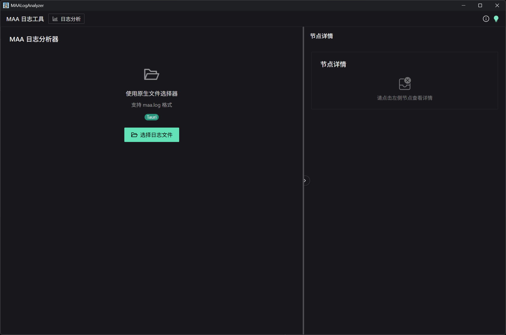
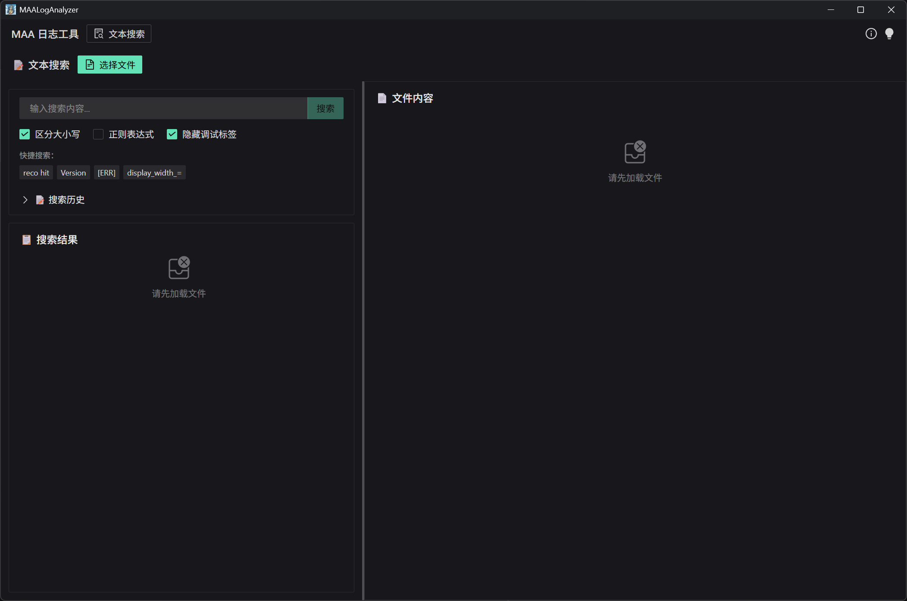
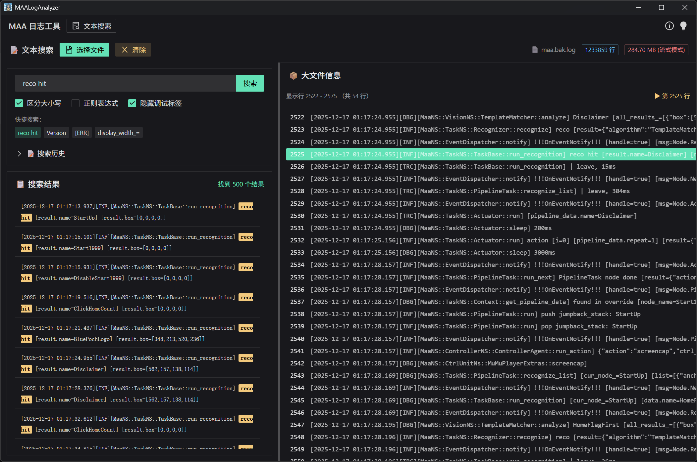
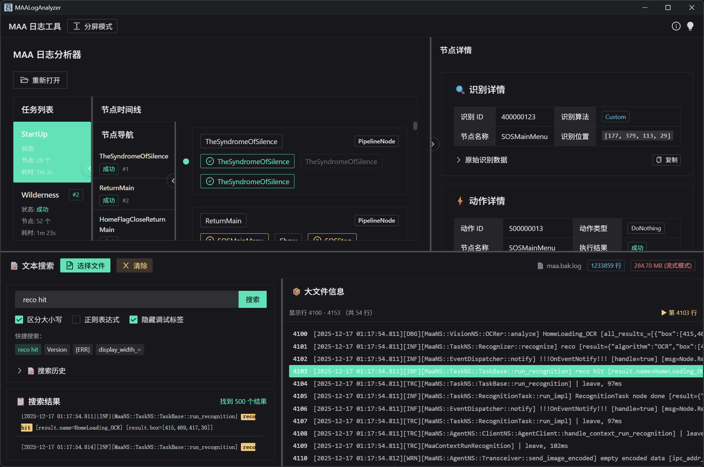

# MAA 日志工具

基于 Vue 3 + Naive UI + Tauri 的 MAAFramework 日志分析工具。

🌍尝试网页版： [https://maaloganalyzer.maafw.xyz](https://maaloganalyzer.maafw.xyz)

🚀下载到本地：[Release](https://github.com/Windsland52/MAALogAnalyzer/releases/latest)

## 📸 界面预览

### 主要功能界面

<!-- markdownlint-disable MD033 -->
<div align="center">
  <picture>
    <source media="(prefers-color-scheme: dark)" srcset="img/1.png">
    <source media="(prefers-color-scheme: light)" srcset="img/1-light.png">
    
  </picture>
  <p><em>日志分析界面</em></p>
</div>

<div align="center">
  <picture>
    <source media="(prefers-color-scheme: dark)" srcset="img/2.png">
    <source media="(prefers-color-scheme: light)" srcset="img/2-light.png">
    
  </picture>
  <p><em>日志分析 - 可视化任务执行流程</em></p>
</div>

<div align="center">
  <picture>
    <source media="(prefers-color-scheme: dark)" srcset="img/3.png">
    <source media="(prefers-color-scheme: light)" srcset="img/3-light.png">
    
  </picture>
  <p><em>文本搜索界面</em></p>
</div>

<div align="center">
  <picture>
    <source media="(prefers-color-scheme: dark)" srcset="img/4.png">
    <source media="(prefers-color-scheme: light)" srcset="img/4-light.png">
    
  </picture>
  <p><em>文本搜索 - 全文搜索功能</em></p>
</div>

<div align="center">
  <picture>
    <source media="(prefers-color-scheme: dark)" srcset="img/5.png">
    <source media="(prefers-color-scheme: light)" srcset="img/5-light.png">
    
  </picture>
  <p><em>分屏模式 - 同时分析和搜索</em></p>
</div>

## ✨ 功能特性

### 📊 日志分析

- 可视化任务执行流程
- 节点状态实时展示（成功/警告/失败）
- 识别与动作详情查看
- 多任务标签页切换
- 支持 sink.log 格式

### 🔍 文本搜索

- 全文搜索（支持正则表达式）
- 大文件流式加载（内存占用极小）
- 快捷搜索选项
- 搜索历史管理
- 上下文显示

### 🎨 用户体验

- 🌓 深色/浅色主题切换
- ⬍ 分屏模式（同时查看分析和搜索）
- 📱 响应式布局
- ⚡ 流畅动画效果

## 🚀 快速开始

### 安装依赖

```bash
pnpm install
```

### 开发模式

```bash
pnpm dev
```

浏览器自动打开 `http://localhost:5173`

### 构建

```bash
# Web 版本
pnpm build

# Tauri 桌面应用
pnpm tauri:dev    # 开发
pnpm tauri:build  # 打包
```

## 📖 使用方法

### 日志分析

1. 点击"日志分析"模式
2. 上传 `sink.log` 文件（参照M9A生成）
3. 查看任务执行流程
4. 点击节点查看详情
5. 点击操作按钮查看识别/动作信息

### 文本搜索

1. 点击"文本搜索"模式
2. 选择日志文件
3. 输入搜索关键词或使用快捷搜索
4. 查看搜索结果
5. 点击结果查看上下文

### 分屏模式

1. 点击"分屏模式"
2. 上半部分：日志分析
3. 下半部分：文本搜索
4. 同时操作两个功能

## 🛠️ 技术栈

- **Vue 3** - 渐进式 JavaScript 框架
- **TypeScript** - 类型安全开发
- **Naive UI** - Vue 3 组件库
- **Vite** - 快速构建工具
- **Tauri** - 跨平台桌面应用框架

## 📁 项目结构

```plaintext
maa-log-analyzer/
├── src/
│   ├── components/            # 可复用组件
│   │   └── NodeCard.vue       # 节点卡片组件
│   ├── views/                 # 页面级组件
│   │   ├── ProcessView.vue    # 日志分析视图
│   │   ├── DetailView.vue     # 详情展示视图
│   │   └── TextSearchView.vue # 文本搜索视图
│   ├── utils/                 # 工具函数
│   │   ├── logParser.ts       # 日志解析器
│   │   ├── fileDialog.ts      # Tauri 文件对话框
│   │   └── errorHandler.ts    # 错误处理工具
│   ├── types.ts               # TypeScript 类型定义
│   ├── Index.vue              # 主组件 (主题管理)
│   ├── App.vue                # 主应用组件
│   ├── main.ts                # 应用入口
│   ├── style.css              # 全局样式
│   └── global.d.ts            # 全局类型声明
├── src-tauri/                 # Tauri 后端配置
│   ├── src/main.rs           # Rust 入口文件
│   ├── Cargo.toml            # Rust 依赖配置
│   └── tauri.conf.json       # Tauri 应用配置
├── scripts/                   # 构建和发布脚本
│   ├── bump-version.js       # 版本更新脚本
│   ├── bump-version.ps1      # PowerShell 版本脚本
│   └── bump-version.bat      # Windows 批处理脚本
├── img/                      # 项目截图
├── index.html                # HTML 模板
├── vite.config.ts            # Vite 构建配置
├── package.json              # Node.js 依赖配置
├── tsconfig.json             # TypeScript 配置
└── README.md
```

### 🏗️ 架构说明

- **组件化设计**: 每个功能模块独立组件，便于维护和复用
- **类型安全**: 完整的 TypeScript 类型定义
- **跨平台支持**: 使用 Tauri 支持 Windows/macOS/Linux
- **主题系统**: 内置深色/浅色主题切换
- **自动化构建**: GitHub Actions 多平台自动构建和发布

## 💡 性能特性

### 大文件支持

- **小文件** (< 5MB): 直接加载到内存，全功能
- **大文件** (≥ 5MB): 流式加载，内存占用 < 5MB
- **超大文件** (100MB+): 边读边搜，不会崩溃

### 内存优化

- 流式文件读取
- 按需加载内容
- 智能状态保持
- 高效的清理机制

## 🔗 相关链接

- [MaaFramework](https://github.com/MaaXYZ/MaaFramework)
- [Naive UI 文档](https://www.naiveui.com/)
- [Tauri 文档](https://tauri.app/)

## 📝 许可证

MIT License

## 🙏 致谢

- [MaaFramework](https://github.com/MaaXYZ/MaaFramework)
- [maa-support-extension](https://github.com/neko-para/maa-support-extension)
